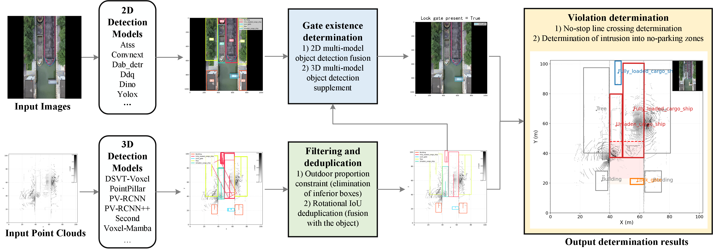

# No-Stop-Line Detection in Sea Locks 🚢

This project focuses on **intelligent detection of no-stop lines in ship locks**, ensuring navigation safety in inland waterways. 
Due to the complex operating environment influenced by **tides, waves, airflow, and dense ship traffic**, conventional detection methods often suffer from false alarms and low robustness. 

**Highlights**: 
* The code has been published, (Sep. 2025)
* The code supports one-click operation.
* The code supports the operation of 2D and 3D models in a multi-conda environment


## Overview
- [Changelog](#changelog)
- [Model Zoo](#model-zoo)
- [Installation](#installation)
- [Getting Started](#GETTING-STARTED)
- [Citation](#citation)


## Changelog
[2025-09-03] `TROUT` v0.1.0 is released. 


## Introduction
We propose a **multimodal fusion approach** that integrates **2D image detection** and **3D LiDAR point cloud detection**, combined with **lock gate presence recognition** and **quality-aware non-maximum suppression (NMS)**, to achieve accurate and reliable violation detection. 

Main contributions:
- ✅ Fusion of 2D and 3D detection results.
- ✅ Gate state detection mechanism to avoid false alarms when gates are open.
- ✅ Dual violation rules: *line-crossing* & *zone intrusion*.
- ✅ Quality optimization of 3D detections with **outdoor proportion constraint + rotational IoU deduplication**.

- DATA at：[Coco_TROUT_data](https://drive.google.com/file/d/1mFQS-TTOR1sSjfPCuIeryK_LND2CLhk9/view?usp=sharing),  [PCDet_TROUT_data](https://drive.google.com/file/d/1JCClYd6egTm0AxXtW80L18AySgG45_og/view?usp=sharing).


<p align="center">
  
</p>


## Model Zoo

### No-Stop-Line Detection in Sea Locks Baselines
* All models are trained with GTX 4080 GPU and are available for download. 

|                                             | All test frames | Real violation frame | Precision | Recall | F1-score  | Miss Rate | False Alarm Rate  |
|---------------------------------------------|----------:|:-------:|:-------:|:-------:|:---------:|:-------:|:-------:|
| Our method   | 8000 | 1351 | 97.78 | 98.95 | 98.36 | 1.05 | 2.22 |


## Installation

First ensure that has been installed mmdetection_trout environment, installation method please refer to [mmdetection_trout_github](https://github.com/serendipitylxd/mmdetection_trout), to ensure that has been installed PCDet_trout environment, Please refer to the [PCDet_trout_github](https://github.com/serendipitylxd/Hydro3DNet) installation method
You can install mmdet and pcd in different conda environments.

## Getting Started

The checkpoint of the 2D model needs to be downloaded and placed in the corresponding path

[atss_trout_261M](https://drive.google.com/file/d/1EhawdW_1tQQAZ-QrreHErOwNxLKmphuP/view?usp=sharing)

[convnext_trout_1125M](https://drive.google.com/file/d/1FyL_ZEuqRl9GxsvgX6Y6Guj0ezOuLvf6/view?usp=sharing) 

[dab_detr_trout_541M](https://drive.google.com/file/d/1k98gA-4NNs8dHuR6qhw5dDHsvJ855uf_/view?usp=sharing)

[ddq_trout_621M](https://drive.google.com/file/d/1098VkIlZuPhmdg4TTM0XuN-t1I3Fb5tC/view?usp=sharing)

[dino_trout_600M](https://drive.google.com/file/d/19gbAcmZjLBu9h8PaDtQMqKo0zxPi_ksi/view?usp=sharing)

[yolox_trout_142M](https://drive.google.com/file/d/1EN7vk39We_iZeQZ0HCwR2M3NkxgN_xgi/view?usp=sharing)
```
No-stop-lines
├── mmdet_models
│   ├── checkpoint
│   │   │── atss.pth
│   │   │── convnext.pth
│   │   │── dab-detr.pth
│   │   │── ddq.pth
│   │   │── dino.pth
│   │   │── yolox.pth
```

The checkpoint of the 3D model needs to be downloaded and placed in the corresponding path

[dsvt_voxel_trout_99M](https://drive.google.com/file/d/1ogt1wMTLQ1vDvJhzAiHGpQztLJH6wF_9/view?usp=sharing)

[pointpillar_trout_58M](https://drive.google.com/file/d/18jLmXM-chjmL1iEtMOzgqvEXxqhz-Hee/view?usp=sharing) 

[pv_rcnn_trout_158M](https://drive.google.com/file/d/11ld6ZocQq39RsFXT_AO4-qH0Qg38XDxd/view?usp=sharing)

[pv_rcnn_plusplus_trout_169M](https://drive.google.com/file/d/1kCMnxVuFaLpKpMWynIiBbFY7-WKGXwyY/view?usp=sharing)

[second_trout_58M](https://drive.google.com/file/d/1jsgBfjvD0Aa7_ywrZR7-zrOrc_WK_Yjz/view?usp=sharing)

[voxel_mamba_trout_142M](https://drive.google.com/file/d/1j6-VIsT_YAJLACLVLMxmxSK5cilgEnfV/view?usp=sharing)
```
No-stop-lines
├── pcdet_models
│   ├── checkpoint
│   │   │── dsvt_voxel.pth
│   │   │── convnext.pth
│   │   │── pv_rcnn.pth
│   │   │── pv_rcnn_plusplus.pth
│   │   │── second.pth
│   │   │── voxel_mamba.pth
```

### How to use TROUT data sets for training and evaluation

Before running the code, you need to open **configs/config.yaml**,**scripts/run_all.py** and make relevant modifications according to the environment you have configured.

Run the full pipeline (2D + 3D detection, fusion, check, evaluation, visualization):

```shell
python scripts/run_all.py --cfg configs/config.yaml
```

Run with all modules disabled (You can skip certain modules according to your needs):

```shell
python scripts/run_all.py --cfg configs/config.yaml --no-2d --no-3d --no-check --no-viz --no-eval
```


## License
`No-stop-lines` is released under the [Apache 2.0 license](LICENSE).

## Acknowledgement

We hope that this repo will serve as a powerful and flexible code base that will benefit the research community by accelerating the process of re-implementing previous work and/or developing new methods.

## Citation
If you find this project useful in your research, please consider cite:


```
@misc{no-stop-line2025,
    title={Multi-Modal Backend Fusion for Intelligent No-Stop Line Violation Detection in Sea-Connected Locks},
    author={Xiaodong Lu, Weikai Tan,Kaofan Liu, Xinyue Luo,Sudong Xu},
    howpublished = {\url{https://github.com/serendipitylxd/No-stop-lines}},
    year={2025}
}
```

## Contribution
Welcome to be a member of the `TROUT` development team by contributing to this repo, and feel free to contact us for any potential contributions. 


